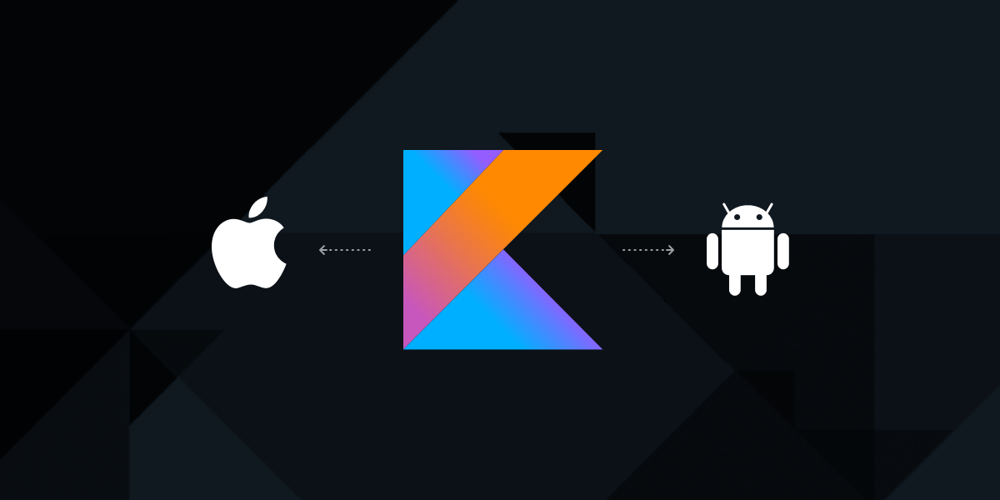

# *Kotlin multiplatform standard* • [](LICENSE.txt)

Kotlin multiplatform standard provides a standard setup for Kotlin multiplatform projects. With this setup, you'll be able to share Kotlin code between Android, JVM and iOS. The code will compile to a platform specific library which you'll be able to distribute via platform specific channels, namely Bintray (Maven) for Android/JVM and CocoaPods for iOS.




## Currently outdated
The current version still uses the old (outdated) gradle setup. But don't worry, we're working on a new version which uses the new setup ;) 


## What's included
- Compile for Android / iOS / JVM
- Upload to Bintray / CocoaPods
- Custom native interop
- Dokka


## Getting started

Get started by cloning/forking this repository and checking out the sample implementations.

#### Prerequisites

- Android Studio for Android & shared development
- Xcode and/or [Appcode](https://www.jetbrains.com/objc/) for iOS specific development
- A [Bintray](https://bintray.com/) account in order to host your library (optional)
- [CocoaPods](https://cocoapods.org) and a private [Spec Repository](https://guides.cocoapods.org/making/private-cocoapods.html) (optional)


## Usage

### Developing using local sources

We included a sample project for Android (`samples/android-app`) and iOS (`samples/ios-app`) which use the local Kotlin sources making them perfect for your library development.

For Android the `samples/android-app` has a dependency on the local library module. Every time you compile this sample app, you'll be using the latest version of the library.

For iOS it is sufficient to open the Xcode project found in `samples/ios-app` and building the project. There is a custom build phase run script which will regenerate the `MyLibrary.framework` file. Note that if you change the name of your library, you will have to change this in the run script as well.

### Publishing

If you want to publish your library to Bintray and/or CocoaPods, you'll need to make some changes in `library/build.gradle` and update the properties to make sure all information matches your specific project and accounts.
These properties will be used for both uploading to Bintray and generating a valid `Podspec` file. For iOS projects, make sure to run `pod install` in the iOS project folder and open the `xcworkspace` project.

#### Publishing your Android/JVM library to Bintray

The easiest way to publish your library on a Maven repository is by using Bintray. Luckily, we already did most of the setup (based on [this article](https://medium.com/@yegor_zatsepin/simple-way-to-publish-your-android-library-to-jcenter-d1e145bacf13)) so you'll be able to get started right away!

After creating a Bintray account, you need to add the following properties to your `local.properties` file in the root of your project:

```
bintray.user=USERNAME
bintray.apikey=API_KEY
```

The next step is preparing your setup on Bintray. Create a new Maven repository (or reuse an existing one) and open up `library/build.gradle`.
Fill in the name of your newly created repo as `bintrayRepo`, update your `bintrayOrganisation` if you want to use one (or leave blank), and update `bintrayName` with the name of your library on Bintray.
Once you're done with that, you can upload the library using the following command:

```
./gradlew bintrayUpload
```

Now your library is published on Bintray, and you can start using it.

#### Publishing your iOS library to CocoaPods

Creating a `Podspec` file is required for publishing a library to CocoaPods. In our setup, gradle will automatically make sure the `Podspec` file is kept up-to-date and running any gradle command (like `./gradlew`) will suffice for updating it.

Before uploading the library to CocoaPods, we need to compile our Kotlin sources into a `.framework` file first.
Run the following command in order to compile your framework file:

```
./gradlew :library:mylibrary-ios:compileKonan
```

The framework file will be stored in the `outputs` folder in the root of our repository so CocoaPods will be able to use it later on.

*Note: If you prefer, you could simply include the framework file in your iOS project too. We recommend a more separated, versioned approach though.*

After generating the framework file, you need to commit/push the file to our git repository. Then you should be able to publish it to a spec repo. But before that, it's best to make sure you didn't make any mistakes. Run the `lint` command to verify if everything looks ok.

```
pod spec lint library/ios/MY_LIBRARY.podspec
```

*Note: This command will probably show a note to warn you about the fact that the framework file doesn't include a file for the i386 architecture. This architecture is only used for the 32-bit iOS simulator, all other architectures should work fine.*

If everything else looks ok, push your library to your private spec repository via:

```
pod repo push [repo] library/ios/MY_LIBRARY.podspec
```

or, push your library to the public spec repository via:

```
pod trunk push library/ios/MY_LIBRARY.podspec
```

Great! Now your library is published on CocoaPods and you'll be able to add it to your project via your `Podfile`.

*For more information about making a CocoaPod, see [Making a CocoaPod](https://guides.cocoapods.org/making/making-a-cocoapod.html)*

### Documentation

We've included a basic setup of [Dokka](https://github.com/Kotlin/dokka) in the project. The latest release at the moment (0.9.17) doesn't support Kotlin/Native yet, so we only generate Android documentation (which includes all the shared code as well).
Simply run `./gradlew dokka` to generate documentation. For more advanced configuration, see [dokka on GitHub](https://github.com/Kotlin/dokka) and `library/android/build.gradle`.


## Why Kotlin multiplatform standard over the rest

At November Five, we prefer to work with versioned libraries when sharing code between multiple applications. This way, we can quickly verify and change the versions used in of our applications.

For Kotlin multiplatform, this allows us to make sure both platforms are using the exact same version of our codebase. There are a few other Kotlin multiplatform templates available on GitHub, but for us, they had two problems:
1) They required using a single repository for both the Android and iOS application. We were already using two separate repositories (one for each platform) and merging them would create a lot of issues in our workflow.
2) None of them had the required setup for hosting the code on a Maven or CocoaPods repository.


## Stability

This software is considered **Beta**.
It has been thoroughly tested internally at November Five but not yet used in any live products.


## Roadmap

Currently the following releases are planned:

#### Kotlin multiplatform standard 0.2.0 (Q4 2018)
- Update the gradle setup to use the upcoming Kotlin Multiplatform project model. We'll probably do this once a stable version of the new `kotlin-multiplatform` plugin has been released.


## Contact

This project is maintained by [*Arne Stockmans*](https://github.com/Arne517) & [*Vincent de Smet*](https://github.com/vdesmet93).

Additional information about the project can be found in this [blog post](https://novemberfive.co/blog/opensourcing-kotlin-multiplatform-standard-github).

Got any questions or ideas? We'd love to hear from you. Check out our [contributing guidelines](CONTRIBUTING.md) for ways to offer feedback and contribute.


## License

Copyright (c) [November Five BVBA](https://novemberfive.co). All rights reserved.

Licensed under the [MIT](LICENSE.txt) License.
